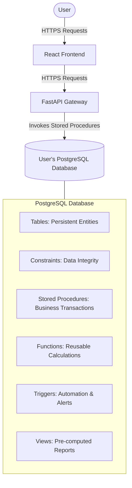

# LedgerDB

**LedgerDB** is a database-centric personal finance management system designed to demonstrate advanced PostgreSQL capabilities. Unlike conventional CRUD applications, nearly all business logic—including validation, financial calculations, reporting, auditing, and budget enforcement—is implemented inside PostgreSQL.

The FastAPI backend acts only as a secure HTTP gateway, while each user provides their own (e.g., Neon) PostgreSQL database, allowing automatic schema provisioning and complete ownership of their financial data. This architecture showcases how modern relational databases can function as active business logic engines rather than passive data stores.

## Architecture

LedgerDB explores an alternative architecture where PostgreSQL acts as the primary business logic engine instead of simply passive storage.

## Why is it useful?

Most personal budgeting applications require the application server to repeatedly calculate monthly expenses, category spending, remaining budgets, etc. This creates duplicated computation and often weakens data integrity.

LedgerDB delegates all these operations directly to PostgreSQL using native database programming constructs:
- **Centralized Business Logic:** By using constraints, functions, and triggers, all calculations happen instantly and accurately upon data insertion.
- **Strong Data Consistency:** Invalid data never reaches permanent storage; ACID transactions guarantee rollback if any step fails.
- **Zero Double-Calculation:** The frontend merely queries views (e.g., `SELECT * FROM MonthlySummary`), with no calculation done on the client or server.
- **User Ownership:** Every user can provision their own database instance (e.g., free tier on Neon). LedgerDB provisions the complete schema directly to their database, ensuring complete data isolation and ownership with almost zero hosting costs.

## How to use it

1. **Create a Database:** Provision your own free PostgreSQL instance (e.g., on [Neon](https://neon.tech/)).
2. **Connect:** Provide your connection string to the LedgerDB application.
3. **Automatic Setup:** LedgerDB validates your credentials and automatically runs the initialization process to create the complete schema, functions, procedures, triggers, and views.
4. **Manage Finances:** 
   - Create expense categories and define monthly budgets.
   - Record, modify, or delete expenses.
   - Monitor real-time spending trends, track remaining budget, and receive automatic overspending alerts natively managed by the database.

## Technical Components

- **Tables:** Core persistent entities (`Users`, `ExpenseCategories`, `Expenses`, `Budgets`, `MonthlySummary`, `Alerts`, `AuditLogs`).
- **Views:** Pre-computed reports like `MonthlyExpenseReport`, `RemainingBudget`, `TopExpenseCategories`.
- **Stored Procedures:** Execute transactions such as `AddExpense()`, `UpdateExpense()`, `ArchiveMonth()`.
- **Functions:** Reusable calculation blocks like `GetRemainingBudget()`, `IsBudgetExceeded()`.
- **Triggers:** Automatically update summaries, recalculate budgets, generate overspending alerts, and create audit records after DML events (e.g., `AFTER INSERT Expense`).

LedgerDB is not just an expense tracker—it is a robust engineering system that puts the DBMS to work.
